# Enterprise Healthcare Claims Lakehouse Pipeline using Medallion Architecture

## Overview

This project demonstrates an enterprise-style healthcare claims data pipeline built using Azure Databricks, Delta Lake, and PySpark following the Medallion Architecture pattern.

The pipeline ingests healthcare claims files from external providers, performs data quality validation, separates invalid records, generates business-ready analytics, and captures audit information for traceability.

---

## Business Problem

Healthcare claim files are received daily from external providers.

The objective is to:

- Ingest raw claims data
- Validate and cleanse records
- Separate rejected records
- Generate analytics-ready datasets
- Maintain complete auditability and traceability

---

## Technology Stack

- Azure Databricks
- Delta Lake
- PySpark
- Azure Data Lake Storage Gen2 (ADLS)
- Unity Catalog
- GitHub

---

## Medallion Architecture

### Architecture Flow

```text
Landing Zone
      |
      v
Bronze Layer
(Raw Ingestion)
      |
      v
Silver Layer
(Data Quality Validation)
      |
      +-------> Reject Layer
      |
      v
Gold Layer
(Business Analytics)
      |
      v
Audit Framework
```

---

## Data Quality Checks

The Silver layer performs:

- Missing Claim ID validation
- Missing Provider Name validation
- Invalid Claim Status validation
- Invalid Service Date validation
- Invalid Claim Received Date validation
- Numeric validation on financial fields

---

## Gold Layer Analytics

The Gold layer generates:

- Claims by Status
- Monthly Claims Trend
- State-wise Claims Summary
- Total Paid Amount
- Provider-Level Summary

---

## Audit Framework

The pipeline captures:

- Batch ID
- Source File Name
- Bronze Record Count
- Silver Record Count
- Reject Record Count
- Pipeline Status
- Processing Timestamp

---

## Project Structure

```text
architecture/
docs/
notebooks/
sample_data/
screenshots/
README.md
```

---

## Sample Dataset

A sample healthcare claims dataset is included for demonstration purposes.

Location:

```text
sample_data/sample_claims.csv
```

---

## Project Status

Production-Style Portfolio Project Completed

## Project Screenshots

### Bronze Layer - Raw Claims Data

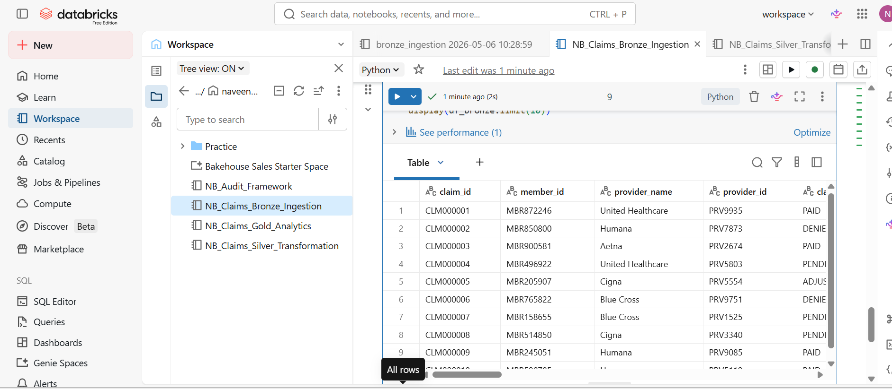

### Bronze Layer - Record Count Validation

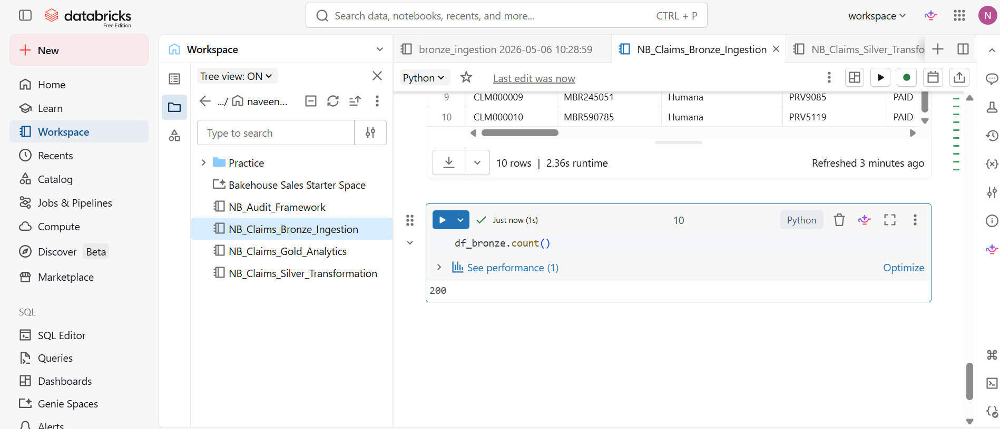

### Silver Layer - Clean Claims Data

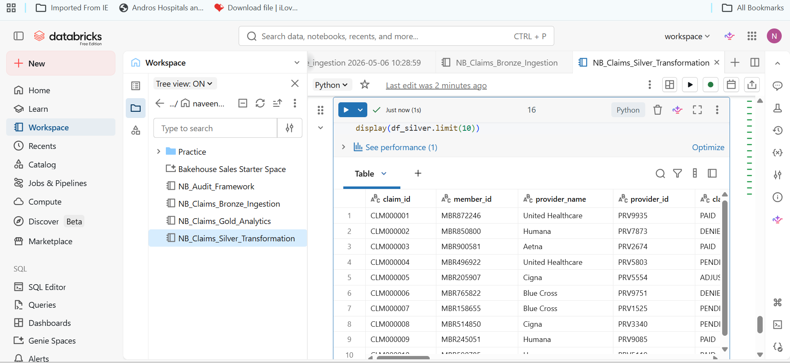

### Silver Layer - Record Count Validation

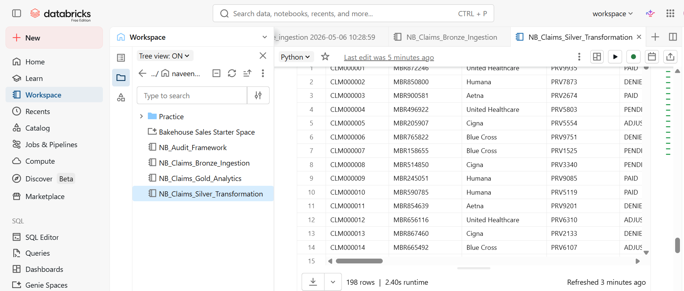

### Reject Layer - Invalid Records

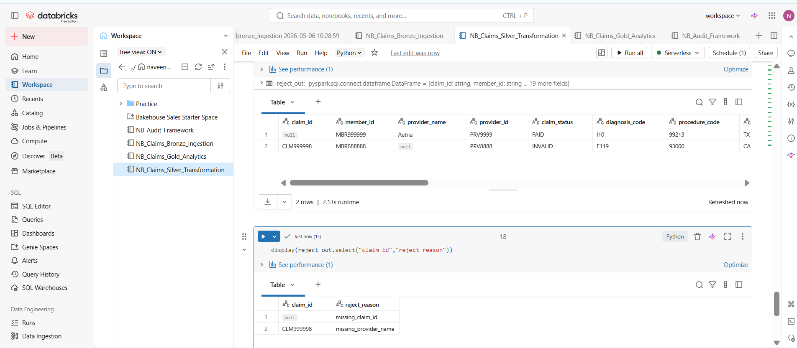

### Gold Layer - Claim Status Summary

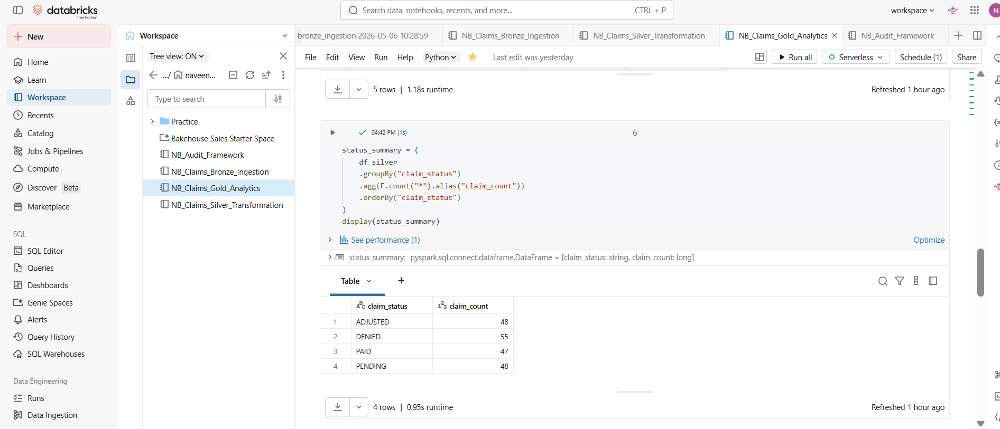

### Gold Layer - Monthly Claims Trend

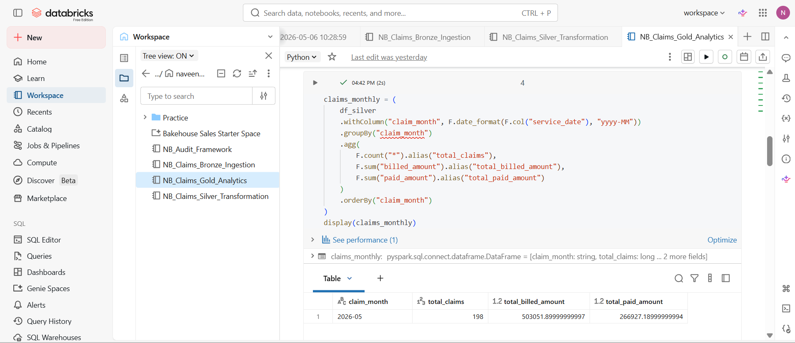

### Gold Layer - State-wise Claims Analytics

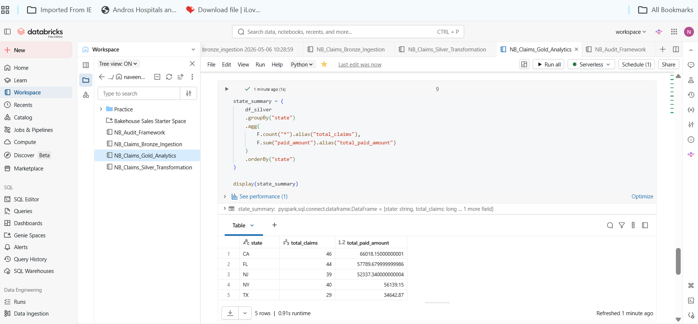

### Gold Layer - Total Paid Amount

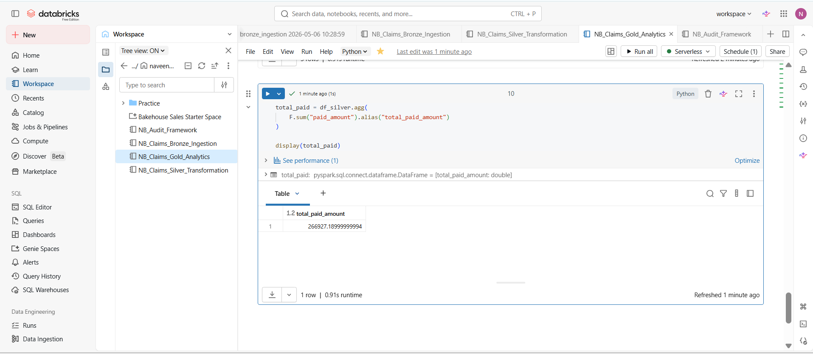

### Gold Layer - Provider Analytics

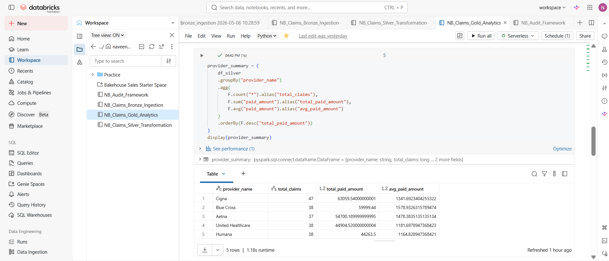

### Job Orchestration Run

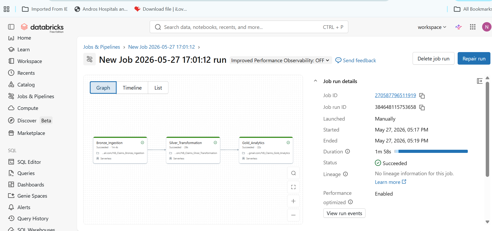

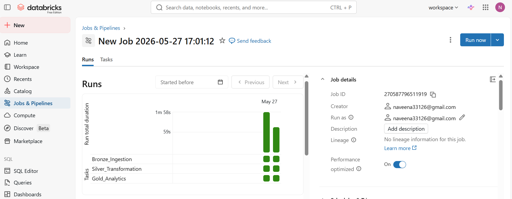

### Audit Framework

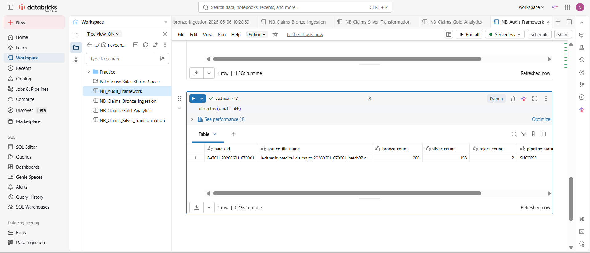
